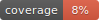

## A Python toolbox for manipulating and assessing colors and palettes

The package provides a Python 3 version of the
[R colorspace](http://colorspace.R-Forge.R-project.org/) package comprising:

- **Color spaces:** Conversions and manipulations of RGB, HSV, CIEXYZ, CIELAB, CIELUV, HCL etc.
- **HCL-based palettes:** Qualitative, sequential, and diverging color maps constructed
  using the HCL (hue-chroma-luminance) color model. These can closely approximate palettes
  from ColorBrewer.org, CARTO, viridis, or Crameri's scientific color maps.
- **matplotlib color maps:** Integration with [matplotlib](https://matplotlib.org/) for
  use in standard plotting functions.
- **Palette visualization:** Plotting palettes in color swatches, spectrums of HCL and/or
  RGB trajectories, and illustrations of typical data visualizations.
- **Interactive palette chooser:** App for exploring, modifying, and picking color
  palettes interactively.
- **Color vision deficiency:** Emulation of different kinds of color blindness.
- **Utilities:** Various color manipulations including tools to desaturate, lighten, darken,
  adjust the transparency, or compute the contrast ratio.

## Links

- **PyPI:** <https://pypi.org/project/colorspace/>
- **GitHub:** <https://github.com/retostauffer/python-colorspace/>
- **Documentation:** <https://retostauffer.github.io/python-colorspace/>
- **Bug reports:** https://github.com/retostauffer/python-colorspace/issues  
  Currently, the package is in advanced beta status. Bug reports and suggestions
  are welcome and very much appreciated!

## Contributors

- [Reto Stauffer](https://retostauffer.org/) (_principal author & maintainer_), Universität Innsbruck, Austria
- [Achim Zeileis](https://www.zeileis.org/), Universität Innsbruck, Austria

Furthermore, the Python package implements the functionality from the R package
that is co-written with
[Ross Ihaka](https://www.stat.auckland.ac.nz/~ihaka/),
[Paul Murrell](https://www.stat.auckland.ac.nz/~paul/),
[Kurt Hornik](https://statmath.wu.ac.at/~hornik/),
[Jason C. Fisher](https://www.usgs.gov/staff-profiles/jason-c-fisher),
[Claus O. Wilke](https://clauswilke.com/),
[Claire D. McWhite](https://clairemcwhite.github.io/).
