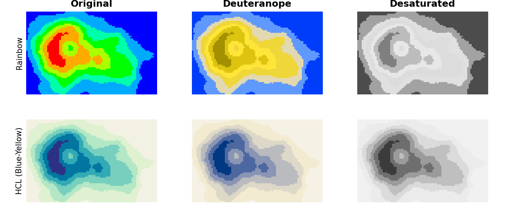

# Summary

Python _colorspace_ provides a toolbox for selecting efficient
color palettes, manipulate and assess these colors, and employ them using
existing plotting and graphing libraries such as e.g., _matplotlib_, _seaborn_,
or _plotly_.

One key feature is that the package provides a variety of color palettes based
on the HCL (hue-chroma-luminance) color space, which has been shown to capture
the three perceptual dimensions of the human visual system very well. Thus,
allowing for intuitive construction of efficient color palettes using
trajectories in the three-dimensional HCL space.
Using general strategies, three main types of HCL-based palettes are
implemented: Qualitative palettes for categorical data, sequential palettes for
mapping ordered/numeric information, and diverging palettes for coding
ordered/numeric data with a central neutral value. Besides a variety of
predefined HCL-palettes, users can customize them or create their own and
integret them in their existing Python workflow.

Furthermore, _colorspace_ provides a variety of function to visualize and
assess (existing) sets of colors and color palettes. In particular allowing to
emulate color vision deficiencies, or calculating contrasts to ensure the set
of colors is accessible for everyone and works everywhere. Overall, the
lightweight _colorspace_ package provides a comprehensive color toolbox going
much further than just providing a series of color palettes.


# Statement of need

Visualization and graphics are often used to communicate (scientific) results.
However, inefficient color maps can easily break things and therefore need to be
chosen carefully
chosen carefully [@Tufte:1990; @Brewer:1999; @Ware:2004; @Wilkinson:2005; @Wilke:2019; @Baum:2019; @Crameri:2020].
In recent years, awareness has grown and many plotting libraries have
changed their default color palette for the better. One well-known example is
the release of Matplotlib `2.0` with an update on mostly all default
colors [@matplotlib20:colors]. Most notably, 'viridis' replaces the classic
'jet' color map, a color map very similar to the infamous RGB rainbow color
palette, which is notorious for causing all sorts of problems.

One way to construct efficient color palettes with the desired characteristics is to
use a perceptual-based color model, a color model that represents the way the human
visual system processes color information [@Kaiser:1996; @Knoblauch:2002]. One such color model is the
Hue-Chroma-Luminance (HCL) model, a three-dimensional color space defined by
the following three axes:

* **Hue:** The type of color
* **Chroma:** Colorfullness
* **Luminance:** Brightness

As these dimensions represent human perception, it allows for an intuitive
construction of a wide range of efficient and well-balanced color palettes. The
_colorspace_ package is not just a collection of fixed palettes, but rather a
set of building blocks to easily create new hand-tailored perceptually-based
palettes or customize existing ones by defining trajectories (paths) trough the
HCL space. These palettes can easily be used with existing plotting and
graphing libraries, so they can be integrated in existing workflows.

In addition, _colorspace_ provides a set of functions and classes for
handling, transforming, manipulating and visualizing color palettes
both from _colorspace_ but also from any other package. In particular, this
includes functionality to emulate color vision deficiencies
[@Vienot:1995; Machado:2009] to check whether or
not a certain color palette is efficient and accessible to everyone.

**RETO: Wuerde ich irgendwo gernen nennen, weiss aber nicht wo :)**

Python _colorspace_ is the Python implementation of the well established
_R_ package [`colorspace`](https://colorspace.r-forge.r-project.org/) [@Zeileis:2020].


# Key functionality

## Chosing and constructing color palettes

A key feature of _colorspace_ is ability to select, modify, and create effective color
maps in the HCL color space. As mentioned above, these are not fixed sets
of colors but define trajectories trough the HCL space. When drawing 'any'
number of colors from a palette, these trajectories are evaluated and (if
needed) converted to e.g., HEX colors (web colors). The package
provides three main classes of HCL-based color palettes:

* `qualitative_hcl`: Create qualitative HCL-based palettes, designed for coding
    categorical information, i.e., where no
    particular ordering of categories is available and every color should
    receive the same perceptual weight.
* `sequential_hcl`: Create sequential HCL-based palettes, designed for coding
    ordered/numeric information, i.e., going from
    high to low (or vice versa).
* `diverging_hcl`: Create diverging HCL-based palettes, designed for coding
    ordered/numeric information around a central
    neutral value, i.e., where colors diverge from neutral to two extremes.


To show the flexibility, \autoref{fig:chosingpalettes} color swatches
for four HCL-based sequential palettes. The first (`pal1`)
is the predefined sequential HCL-based 'viridis' palette as is the second one
(`pal2`), but this time constructed by hand, specifying the properties of
all three trajectories.
The remaining two start with the 'viridis' settings, but adjust certain properties.
While `pal3` overwrites the chroma trajectory with a triangular one ending in
lower chroma than the original, `pal4` limits the hue range to the green-yellow
range.

```
from colorspace import palette, sequential_hcl, swatchplot

pal1 = sequential_hcl(palette = "viridis")
pal2 = sequential_hcl(h = [300, 75], c = [40, 95], l = [15, 90],
                      power = [1., 1.1])
pal3 = sequential_hcl(palette = "viridis", cmax = 90,  c2 = 20)
pal4 = sequential_hcl(palette = "viridis", h1 = 200)

swatchplot([palette(pal1(7), "By name"),
            palette(pal2(7), "By hand"),
            palette(pal3(7), "With triangular chroma"),
            palette(pal4(7), "With smaller hue range")],
            figsize = (8, 1.75));
```


The objects provide a series of methods to e.g., extract the settings of
the trajectories, get $n$ HEX colors, or a matplotlib color map.

```
pal1.settings      # Extracting settings
pal1(3)            # Extracting 3 colors
pal1.cmap()        # Get matplotlib colormap
```

Besides the HCL-based version of 'viridis', _colorspace_ comes with a wide
range of color palettes which can be used (and modified if needed).
\autoref{fig-hcl-palettes} gives an overview of the available palettes.

```
from colorspace import hcl_palettes
hcl_palettes(plot = True, figsize = (20, 15))
```


## Assessing color maps

To demonstrate some of the functionality for palette assessment,
\autoref{fig:specplothclplot} shows a color spectrum plot (left) and
a slice through the HCL space (right) for color palette `pal4` as defined
in the previous section.

The bottom panel of the spectrum plot shows the H, C, and L trajectories,
which all change monotonically from one end of the
palette to the other. The slight kink in the chroma trajectory results from
touching the outer edge of the HCL space. This can also be seen in the
slice through the HCL space, where the darker half of the palette scrapes
along the outer edge.


```
# Color spectrum (left subplot)
pal4.specplot(figsize = (5, 5));

# Palette plot in HCL space (right subplot)
pal4.hclplot(n = 7, figsize = (5, 5));
```


## Color vision deficiency

\autoref{fig-cvd} shows how badly inefficient color maps can break down.
The figure shows the same data four times, once using a palette based on the 
RGB rainbow (left) and once using the sequential HCL palette
'Blue-Yellow' (right). While the top row shows the original colors for people
without visual constraints, the bottom row shows an emulation of how people with
deuteranomaly (colloquially known as "red-green color blindness") perceive the
same information [@Vienot:1995; @Machado:2009; @Knoblauch:2002].

This is admittedly an extreme example, but it illustrates how quickly inefficient color
maps can break down, making certain figures and results inaccessible to certain
groups of people. While many better alternatives to the RGB rainbow are readily
available, the RGB rainbow and palettes with similar problems have been used
for a long time with little caution and can still be found in use today.


```
from colorspace import demoplot, rainbow, sequential_hcl, deutan
from colorspace import diverging_hcl
import matplotlib.pyplot as plt

col1 = rainbow(end = 1/3, rev = True).colors(11)
col2 = sequential_hcl("Blue-Yellow", rev = True).colors(11)

fig, ax = plt.subplots(2, 2, figsize = (10, 5))

demoplot(col1, "Map", ax = ax[0,0], title = "(In-)famous Rainbow palette",
         ylabel = "original")
demoplot(col2, "Map", ax = ax[0,1], title = "HCL-based Blue-Yellow")
demoplot(deutan(col1), "Map", ax = ax[1,0], ylabel = "deuteranope")
demoplot(deutan(col2), "Map", ax = ax[1,1])
```




Besides `deutan` (emulate deuteranomaly) _colorspace_ allows
to emulate other deficiencies as well. More details and examples can be found
on the [package documentation](https://retostauffer.github.io/python-colorspace/).


## Use with existing plotting libraries

Color palettes made accessible via the _colorspace_ package can easily
be deployed with existing plotting or graphics libraries. \autoref{fig-plotting}
shows two small examples using a data set shipped with the package.

The `matplotlib` figure (left) shows a 2-d histogram of daily minimum and maximum temperatures
for a weather station in Germany, the `seaborn`-based plot (right) the distribution of the
average daily temperature for the same location, split into seasons.
Whilst a 'cmap' (`.cmap()`; `LinearSegmentedColormap`) is used with `matplotlib`,
`seaborn` just requires a list of HEX colors (`.colors(4)`).
Additional examples for `matplotlib` [@Hunter:2007],
`seaborn` [@Waskom:2021], and `plotly` [@plotly] can be found in the
[package documentation](https://retostauffer.github.io/python-colorspace/).


```
from colorspace import dataset, qualitative_hcl
import matplotlib.pyplot as plt
import seaborn as sns

df = dataset("HarzTraffic") # Loading data; requires pandas

# Demoplot using `matplotlib`
fig = plt.hist2d(df.tempmin, df.tempmax, bins = 20,
                 cmap = pal3.cmap().reversed())

plt.title("Joint density daily min/max temperature")
plt.xlabel("minimum temperature [deg C]")
plt.ylabel("maximum temperature [deg C]")
plt.show()


# Demoplot using `seaborn`
from colorspace import qualitative_hcl, dataset
import seaborn as sns 

# Color palette to be used
pal = qualitative_hcl("Dark 3", h1 = -180, h2 = 100)

g = sns.displot(data = df, x = "tempmax", hue = "season", fill = "season",   
                kind = "kde", rug = True, height = 4, aspect = 1,
                palette = pal.colors(4))
g.set_axis_labels("temperature [deg C]")              
g.set(title = "Distribution of daily maximum temperature given season")
plt.tight_layout()
plt.show()
```


# Dependencies and availability

With a light-weight design in mind, most core functionality only requires `numpy`.
For full functionality, `matplotlib`, `imageio` and `pandas` will need to be installed.

_colorspace_ is available via [PyPI](https://pypi.org/project/colorspace).
[source code](https://github.com/retostauffer/python-colorspace) and
[package documentation](https://retostauffer.github.io/python-colorspace/) are
hosted on github, where bug reports, software contributions and feature requests
are always welcome.


# Acknowledgements

**RETO: Brauchen wir sowas? Haette sonst hier noch der alten R-colorspace-Gang
gedankt, aber Platz ist eigentlich eh keiner.**


# References


