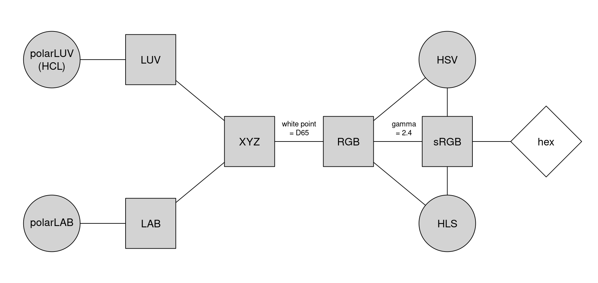
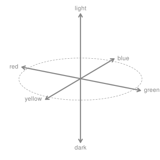

.. _article-color_spaces:

Color Spaces: Classes and Utilities
===================================

Overview
--------

At the core of the colorspace package are various utilities for computing with
color spaces :cite:`color:Wiki+Colorspace`, as the name conveys. Thus, the package helps to
map various three-dimensional representations of color to each other :cite:`color:Ihaka:2003`.
A particularly important mapping is the one from the perceptually-based
and device-independent color model HCL (Hue-Chroma-Luminance) to standard
Red-Green-Blue (sRGB) which is the basis for color specifications in many
systems based on the corresponding hex codes :cite:`color:Wiki+Webcolors`, e.g., in HTML
but also in R. For completeness further standard color models are included as
well in the package. Their connections are illustrated in the following graph:

Color models that are (or try to be) perceptually-based are displayed with
circles and models that are not are displayed with rectangles. The
corresponding classes and eponymous class constructors in colorspace are:

* :py:class:`RGB<colorspace.colorlib.RGB>`
  for the classic Red-Green-Blue color model, which mixes three primary
  colors with different intensities to obtain a spectrum of colors. The
  advantage of this color model is (or was) that it corresponded to how
  computer and TV screens generated colors, hence it was widely adopted and
  still is the basis for color specifications in many systems. For example, hex
  color codes are employed in HTML but also in R. However, the RGB model also
  has some important drawbacks: It does not take into account the output device
  properties, it is not perceptually uniform (a unit step within RGB does not
  produce a constant perceptual change in color), and it is unintuitive for
  humans to specify colors (say brown or pink) in this space.
  :cite:`color:Wiki+Colorspace`
* :py:class:`sRGB<colorspace.colorlib.sRGB>`
  addresses the issue of device dependency by adopting a so-called
  gamma correction. Therefore, the gamma-corrected standard RGB (sRGB), as
  opposed to the linearized RGB above, is a good model for specifying colors in
  software and for hardware. But it is still unintuitive for humans to work
  directly with this color space. Therefore, sRGB is a good place to end up in
  a color space manipulation but it is not a good place to start.
  :cite:`color:Wiki+sRGB`
* :py:class:`HSV<colorspace.colorlib.HSV>`
  is a simple transformation of the (s)RGB space that tries to capture
  the perceptual axes: hue (dominant wavelength, the type of color), saturation
  (colorfulness), and value (brightness, i.e., light vs. dark). Unfortunately,
  the three axes in the HSV model are confounded so that, e.g., brightness
  changes dramaticaly with hue. :cite:`color:Wiki+Webcolors`
* :py:class:`HSL<colorspace.colorlib.HSL>`
  (Hue-Lightness-Saturation) is another transformation of (s)RGB that
  tries to capture the perceptual axes. It does a somewhat better job but the
  dimensions are still strongly confounded.
  :cite:`color:Wiki+HSV`
* :py:class:`CIEXYZ<colorspace.colorlib.CIEXYZ>`
  was established by the CIE (Commission Internationale de l’Eclairage)
  based on experiments with human subjects. It provides a unique triplet of XYZ
  values, coding the standard observer’s perception of the color. It is
  device-independent but it is not perceptually uniform and the XYZ coordinates
  have no intuitive meaning.
  :cite:`color:Wiki+CIEXYZ`
* :py:class:`CIELUV<colorspace.colorlib.CIELUV>`
  and
  :py:class:`CIELAB<colorspace.colorlib.CIELAB>`
  were therefore proposed by the CIE as perceptually
  uniform color spaces where the former is typically preferred for emissive
  technologies (such as screens and monitors) whereas the latter is usually
  preferred when working with dyes and pigments. The L coordinate in both
  spaces has the same meaning and captures luminace (light-dark contrasts).
  Both the U and V coordinates as well as the A and B coordinates measure
  positions on red/green and yellow/blue axes, respectively, albeit in somewhat
  different ways. While this corresponds to how human color vision likely
  evolved (see the next section), these two color models still not correspond
  to perceptual axes that humans use to describe colors.
  :cite:`color:Wiki+HSV,color:Wiki+CIELAB`
* :py:class:`polarLUV<colorspace.colorlib.polarLUV>`
  (= :py:class:`HCL<colorspace.colorlib.HCL>`)
  and
  :py:class:`polarLAB<colorspace.colorlib.polarLAB>`
  therefore take polar coordinates in the UV plane
  and AB plane, respectively. Specifically, the polar coordinates of the LUV
  model are known as the HCL (Hue-Chroma-Luminance) model (see Wikipedia 2019e,
  which points out that the LAB-based polar coordinates are also sometimes
  referred to as HCL). The HCL model captures the human perceptual axes very
  well without confounding effects as in the HSV or HLS approaches. (More
  details follow below.)

Human color vision and the HCL color model
------------------------------------------

It has been hypothesized that human color vision has evolved in three distinct stages:

1. Perception of light/dark contrasts (monochrome only).
2. Yellow/blue contrasts (usually associated with our notion of warm/cold colors).
3. Green/red contrasts (helpful for assessing the ripeness of fruit).

See :cite:`color:Kaiser+Boynton:1996`, :cite:`color:Knoblauch:2002`, :cite:`color:Ihaka:2003`,
:cite:`color:dichromat`, and/or :cite:`color:Zeileis+Hornik+Murrell:2007`
for more details and references. Thus, colors can be described using a
3-dimensional space:

However, for describing colors in such a space, it is more natural for humans
to employ polar coordinates in the color plane (yellow/blue vs. green/red,
visualized by the dashed circle above) plus a third light/dark axis. Hence,
color models that attempt to capture these perceptual axes are also called
perceptually-based color spaces. As already argued above, the HCL model
captures these dimensions very well, calling them: hue, chroma, and luminance.

The corresponding sRGB gamut, i.e., the HCL colors that can also be represented
in sRGB, is visualized in the animation below :cite:p:`color:Horvath+Lipka:2016`.

* `Link to video (wikimedia.org) <https://upload.wikimedia.org/wikipedia/commons/transcoded/8/8d/SRGB_gamut_within_CIELCHuv_color_space_mesh.webm/SRGB_gamut_within_CIELCHuv_color_space_mesh.webm.480p.vp9.webm>`_

The shape of the HCL space is a distorted double cone which is seen best by
looking at vertical slices, i.e., chroma-luminance planes for given hues. For
example, the left panel below depicts the chroma-luminance plane for a certain
blue (hue = 255). Along with luminance the colors change from dark to light.
With increasing chroma the colors become more colorful, where the highest
chroma is possible for intermediate luminance.

As some colors are relatively dark (e.g., blue and red assume their maximum
chroma for relatively low luminances) while others are relatively light (e.g.,
yellow and green), horizontal slices of hue-chroma planes for given hue have
somewhat irregular shapes. The right panel below shows such a hue-chroma plane
for moderately light colors (luminance = 70). At that luminance, green and
orange can become much more colorful compared to blue or red.

.. image:: images/hcl-projections-1.png
    :width: 100%
    :align: center

.. todo:: This is an R image; functionality not yet included in the python package.

Utilities
---------

Several methods are available for working the different colorpalette classes
listed above.

.. ipython:: python
    :okwarning:

    from colorspace.colorlib import hexcols
    cols = hexcols(["#FCFFC9", "#E8C167", "#D67500", "#913640", "#1D0B14"])
    print(cols)

    cols.to("RGB") # Convert hex colors to RGB
    print(cols)
    cols.to("HCL") # Convert to HCL (RGB to HCL)
    print(cols)

    print(cols.colors()) # Get HEX color list

    @savefig color_spaces_utilities_specplot.png scale=90% width=400px height=200px align=center
    cols.specplot()      # Create spectrum plot from given color object

    @savefig color_spaces_utilities_swatchplot.png scale=70% width=400px height=100px align=center
    cols.swatchplot()    # Corresponding watchplot

References
----------

.. bibliography:: ../references.bib
    :cited:
    :style: plain
