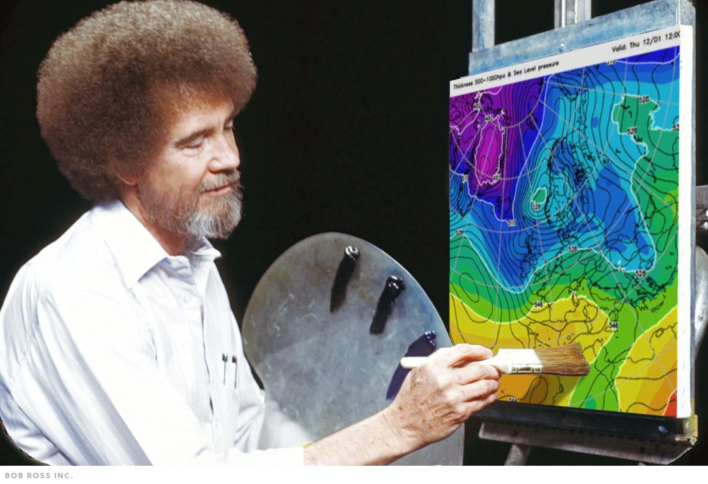
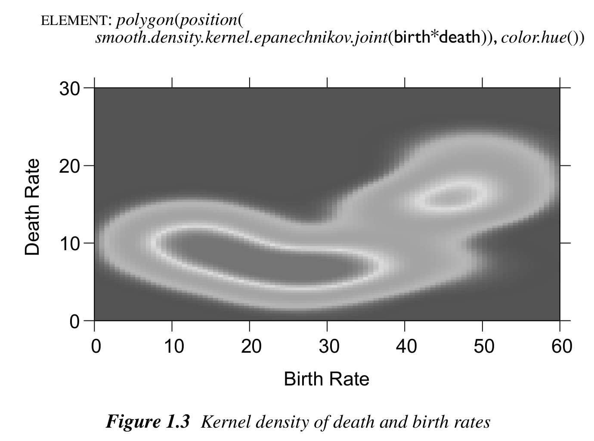
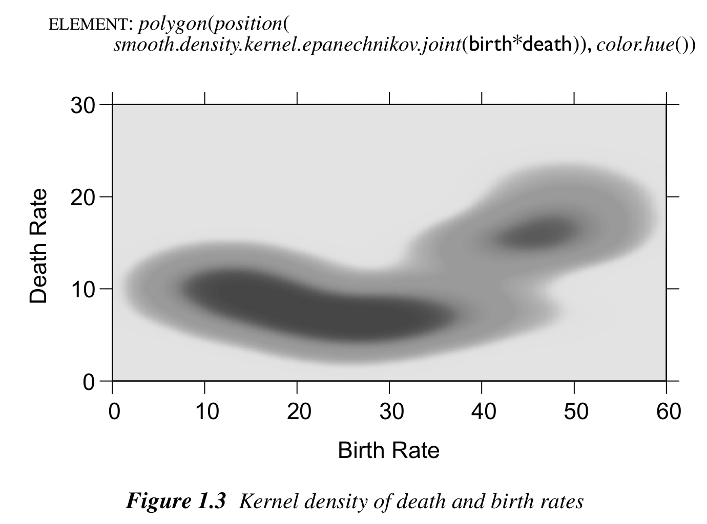
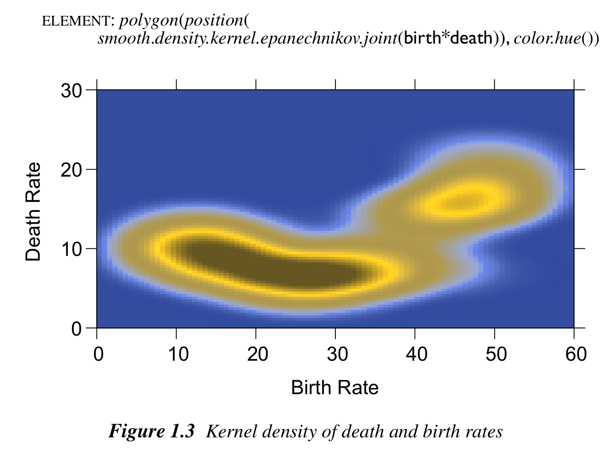
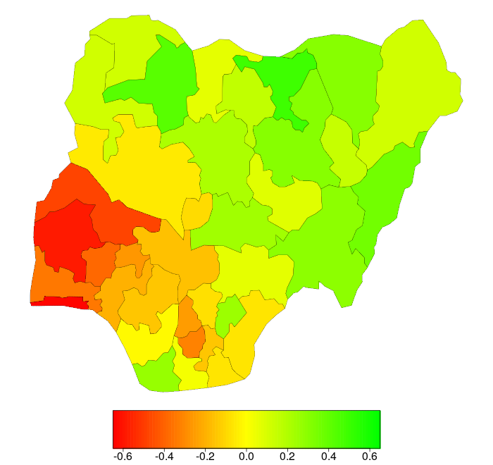
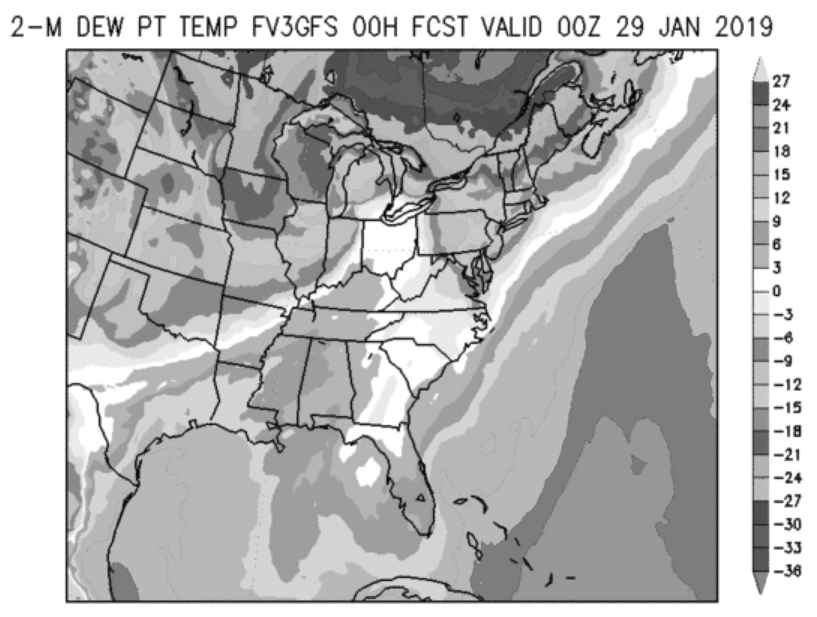
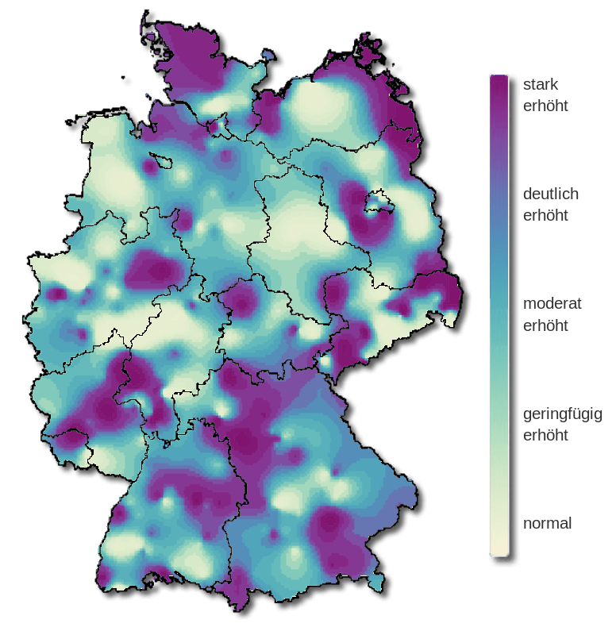
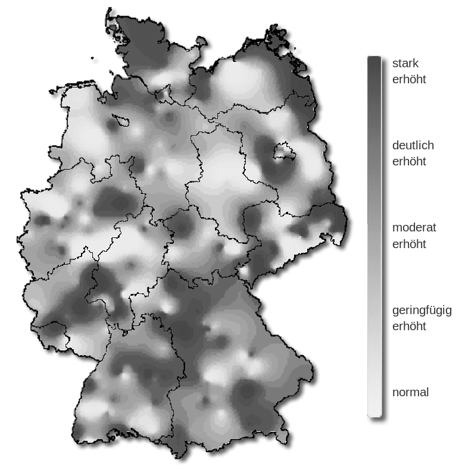
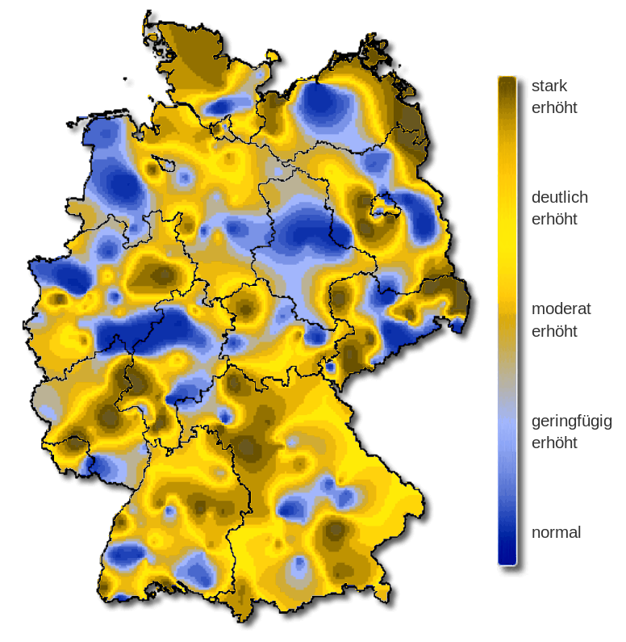

.. _article-endrainbow:

Somewhere over the Rainbow
==========================

.. currentmodule:: colorspace

Overview
--------

The go-to palette in many software packages is - or used to be until rather
recently - the so-called rainbow: a palette created by changing the hue in
highly-saturated RGB colors. This has been widely recognized as having a number
of disadvantages including: abrupt shifts in brightness, misleading for viewers
with color vision deficiencies, too flashy to look at for a longer time. See
also the article on :ref:`color vision deficiencies<_article-color_vision_deficiency_emulation>`
which compares the infamous RGB :py:class:`rainbow`
with better HCL-based alternatives using :py:func:`demoplot`. Here, we provide
further rainbow examples taken from actual publications (rather than simplified
demos).

For more details on the limitations of the rainbow palette and further pointers
see "`The End of the Rainbow <http://www.climate-lab-book.ac.uk/2014/end-of-the-rainbow/>`_"
by :cite:t:`color:Hawkins+McNeall+Stephenson:2014`,
"`Examining Implicit Discretization in Spectral Schemes <https://vdl.sci.utah.edu/publications/2019_eurovis_implicit-discretization/>`_"
by :cite:t:`color:Quinan+Padilla+CreemRegehr:2019`, or
"`Somewhere over the Rainbow: How to Make Effective Use of Colors in Meteorological Visualizations <https://dx.doi.org/10.1175/BAMS-D-13-00155.1>`_"
by :cite:t:`color:Stauffer+Mayr+Dabernig:2015` as well as the
`#endrainbow <https://twitter.com/hashtag/endrainbow>`_ hashtag on Twitter.

In a nutshell, the (in-)famous RGB rainbow palette is virtually always a poor choice and properly balanced qualitative, sequential, or diverging palettes - such as the
:ref:`article-hcl_palettes` provided here - are
preferable. Despite such alternatives becoming more and more widely available
the rainbow palette is unfortunately still widely used. Below we illustrate
some wild-caught examples, highlight their problems (e.g., by desaturation to
grayscale or by emulating color vision deficiencies), and suggest better
alternatives.

Would Bob Ross approve?
-----------------------

When you see a (scientific) data visualization with a rainbow, ask yourself:
Would `Bob Ross <https://www.bobross.com/>`_ approve of this?

Most likely not. In contrast, choosing a HCL-based palette instead will yield
less flashy colors that change smoothly ... very much in the spirit of
*The Joy of Painting.*

Heatmap from The Grammar of Graphics
------------------------------------

Even in the excellent book
"`The Grammar of Graphics <https://www.cs.uic.edu/~wilkinson/TheGrammarOfGraphics/GOG.html>`_"
by :cite:t:`color:Wilkinson:2005`, the rainbow palette is used in one of the
first figures, depicting a heatmap of a bivariate kernel density estimate. The
figure is shown below on the left and is contrasted with an HCL-based
sequential heat color palette on the right
(``sequential_hcl("Heat")(99)``).

.. image:: images/bkde-rainbow.png
    :width: 50%
    :class: img-float-left
.. image:: images/bkde-heat.png
    :width: 50%

The original palette changes back and forth between dark and light colors and
hence high- and low-density regions are difficult to tell apart, especially
when desaturated to grayscale. In contrast, the heat colors go from light to
dark and still work very well in grayscale.

Similarly, high- and low-density regions are much harder to distinguish for
colorblind viewers in the original rainbow palette compared to the heat colors.
Below deuteranope vision is emulated.

.. image:: images/bkde-heat-deutan.png
    :width: 50%

Map of model deviations
-----------------------

Often a subset of the RGB rainbow palette is used as a "traffic light", coding
"positive" (green) and "negative" (red) deviations from some neutral value
(yellow), e.g., forecast errors or other model deviations, correlations,
slopes, etc. A typical example is shown below, taken from Figure 5 of
:cite:t:`color:Kneib:2006`, where deviations from a childhood moratlity model
(without spatial effect) for Nigeria are depicted.

The original palette is ``rainbow(start = 0, end = 1/3, rev = True)(99)`` (left)
and as a better alternative ``diverging_hcl("Purple-Green", rev = True)(99)`` is used. This
avoids the flashy colors and uses light gray as the neutral value, making it
easier to look at the display for a longer time. Instead of diverging to
red/green the palette diverges to purple/green as this works better for
colorblind viewers (see below).

.. image:: images/nigeria-purplegreen.png
    :width: 50%

Emulating protanope vision most of the green-yellow contrasts in the RGB
rainbow are collpased, making the plot very misleading while the HCL-based
purple/green palette still works very well for colorblind viewers.

.. image:: images/nigeria-rainbow-protan.png
    :width: 50%
    :class: img-float-left
.. image:: images/nigeria-purplegreen-protan.png
    :width: 50%

Another important difference between the two palettes is that the HCL-based
alternative is completely balanced between the two “arms” of the palette while
the rainbow is not. Specifically, the green arm has an almost flat luminance
trajectory while the red arm reaches much lower luminances (i.e., darker
colors).

.. plot::
    :width: 80%

    from colorspace import rainbow, specplot
    pal = rainbow(start = 0, end = 1/3, rev = True)
    specplot(pal(99))

.. plot::
    :width: 80%

    from colorspace import diverging_hcl, specplot
    pal = diverging_hcl("Purple-Green", rev = True)
    specplot(pal(99))

Weather map: Dewpoint temperature
---------------------------------

Another shaded map for communicating a weather forecast is shown below,
depicting dewpoint temperature forecasts from a certain FV3 Global Forecast
System (GFS) product. It also does not use a standard rainbow but a palette of
similarly highly-saturated colors from a wide range of hues (left panel).

As in the previous section, the palette is very discontinuous and breaks the
values down into separate "classes" or "bands". For experienced users this may
help locating bands with very specific numeric values but leads to an uneven
overall picture. In contrast, the ``sequential_hcl("ag_Sunset").colors(23)`` palette
(right panel) shows a smooth gradient, giving somewhat more emphasis to the
darker low-temperature regions.

.. image:: images/fv3gfs-rainbow.png
    :width: 50%
    :class: img-float-left
.. image:: images/fv3gfs-sunset.png
    :width: 50%

Depicting the hue/chroma/luminance trajectories of both palettes also shows the
abrupt changes in the original palette which do not convey a continuous
temperature scale. Instead, the HCL-based sunset palette is also built from a
wide range of hues but changes hue, chroma, and luminance smoothly.

.. plot::
    :width: 80%

    from colorspace import specplot
    original = ["#F6C77B", "#A8373A", "#009BFF", "#D35252", "#0DD189", "#E3AF36",
                "#9CE743", "#EE8130", "#FE9E23", "#E4E4E4", "#ACFBA4", "#4EF159",
                "#1BA120", "#00DE28", "#92CDF8", "#3D8FF0", "#205FCD", "#0EC6C6",
                "#BCAEFD", "#4D33C4", "#9B00C4", "#2829FB", "#F83940"]
    specplot(original)

.. plot::
    :width: 80%

    from colorspace import sequential_hcl, specplot
    pal = sequential_hcl("ag_Sunset").colors(23)
    specplot(pal)

Consequently, the figure with the sunset palette also works reasonably well in
grayscale or for colorblind viewers while the original palette is rather
problematic.

.. image:: images/fv3gfs-sunset-gray.png
    :width: 50%

.. image:: images/fv3gfs-rainbow-deutan.png
    :width: 50%
    :class: img-float-left
.. image:: images/fv3gfs-sunset-deutan.png
    :width: 50%

Risk map: Influenza
-------------------

The shaded map below was taken from the web site of the
`Robert Koch-Institut <https://influenza.rki.de/>`_ (Arbeitsgemeinschaft Influenza)
and it shows the severity of influenza in Germany in week 8, 2019. The original
color palette (left) is the classic rainbow ranging from “normal” (blue) to
“strongly increased” (red). As all colors in the palette are very flashy and
highly-saturated it is hard to grasp intuitively which areas are most affected
by influenza. Also, the least interesting “normal” areas stand out as blue is
the darkest color in the palette.

As an alternative, a proper multi-hue ``sequential_hcl("Purple-Yellow")(99)``
palette is used on the right. This has smooth gradients and the overall message
can be grasped quickly, giving focus to the high-risk regions depicted with
dark/colorful colors. However, the extremely sharp transitions between “normal”
and “strongly increased” areas (e.g., in the North and the East) might indicate
some overfitting in the underlying smoothing for the map.

.. image:: images/influenza-rainbow.png
    :width: 50%
    :class: img-float-left

Converting all colors to grayscale brings out even more clearly why the overall
picture is so hard to grasp with the original palette: The gradients are
discontinuous switching several times between bright and dark. Thus, it is hard
to identify the high-risk regions while this is more natural and
straightforward with the HCL-based sequential palette.

.. image:: images/influenza-rainbow-gray.png
    :width: 50%
    :class: img-float-left

Emulating deuteranope vision emphasizes the same problems as the desaturated
version above but shows even more problems with the original palette.

.. image:: images/influenza-purpleyellow-deutan.png
    :width: 50%

Showing changes in hue/chroma/luminance across the two palettes also highlights
the discontinuity vs. smoothness of the two palettes.

.. plot::
    :width: 80%

    from colorspace import rainbow, specplot
    pal = rainbow(end = 2/3, rev = True)
    specplot(pal(99))

.. plot::
    :width: 80%

    from colorspace import sequential_hcl, specplot
    pal = sequential_hcl("Purple-Yellow", rev = True)
    specplot(pal(99))

References
----------

.. bibliography:: ../references.bib
    :style: plain

